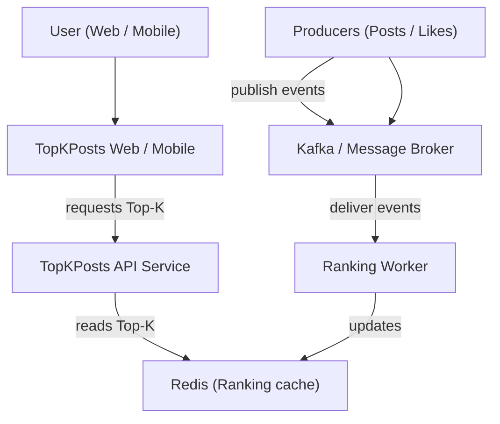
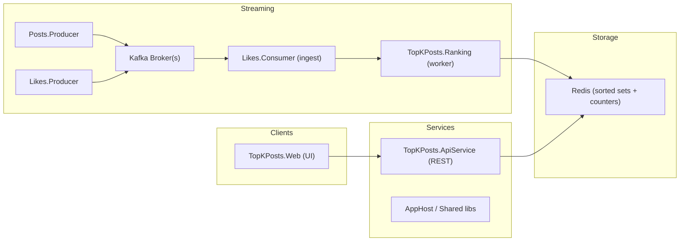
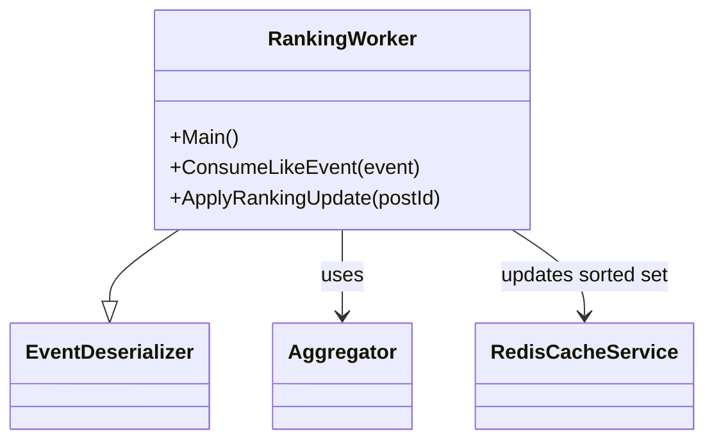

# TopKPosts — Real-time Top-K Posts

This repository implements a small streaming system that computes and serves the Top‑K posts by likes in (near) real time. The system is implemented as a set of small .NET services that use message streams, background workers and an in‑memory cache to keep a fast, consistent view of the most popular posts.

This README explains the problem, the overall architecture and shows C4-style models (Context / Container / Component) to help developers and architects understand, extend and operate the system.

**Problem we solve**
- **Goal:** continuously maintain and serve the Top‑K posts by likes with low latency and horizontal scalability.
- **Constraints:** high write volume (likes and posts events), reads should be fast (API and UI), eventual consistency acceptable with bounded staleness, and the solution should be horizontally scalable.

Why streaming? Likes arrive as events. Recomputing Top‑K by scanning all posts on every update is expensive. Instead we maintain counters and a ranked structure (kept in Redis) and update it incrementally on each event.

High-level architectural summary
- Producers: components that emit domain events (post created, like added).
- Message broker: lightweight streaming backbone (Kafka in the code structure) used to reliably deliver events to consumers.
- Consumers / Workers: background processes that consume events, update counters and ranking state.
- Redis cache: stores counters and the sorted set for Top‑K for fast reads.
- API / Web: exposes Top‑K to clients and serves the UI.

Repository mapping
- `TopKPosts.Posts.Producer` — emits new post events
- `TopKPosts.Likes.Producer` — emits like events
- `TopKPosts.Posts.Consumer` — consumes post events (if any processing needed)
- `TopKPosts.Likes.Consumer` — consumes like events and forwards or transforms as needed
- `TopKPosts.Ranking` / `RankingWorker.cs` — the worker that computes/updates rankings
- `TopKPosts.Redis` — Redis cache wrapper and helpers (`RedisCacheService.cs`)
- `TopKPosts.ApiService` and `TopKPosts.Web` — API and UI layers for read access
- `TopKPosts.ServiceDefaults` / `TopKPosts.AppHost` — shared configuration and hosting helpers

Key data flows
- Topic `posts` — Post created/updated events (id, author, timestamp, ...)
- Topic `likes` — Like events (postId, userId, timestamp)
- Ranking worker consumes `likes` (and optionally `posts`) and performs:
  - increment post like counter
  - update sorted set for ranking (Redis ZINCRBY / ZADD)
  - persist counters if needed (optional durable store)

Serving Top‑K
- API reads the Top‑K from Redis sorted set (ZREVRANGE) which returns top items with O(log(N)+K) performance.

Scaling notes
- Producers are stateless — scale horizontally.
- Kafka scales by partitions — workers can form consumer groups for parallel processing.
- Redis: use a cluster for large datasets or shard Top‑K namespaces per tenant.

Security and reliability
- Use TLS and authentication for Kafka and Redis in production.
- Make sure consumers use idempotent updates (e.g., sequence numbers or deduplication) when events may be reprocessed.

C4 Models (text + renderable diagrams)

1) System Context (level 1)

This shows the TopKPosts system and its primary users / external systems.

Mermaid diagram (paste into a Mermaid renderer or use VS Code Mermaid preview):



2) Container Diagram (level 2)

Shows containers (run-time executables / services): API, Web, Producers, Consumers/Workers, Redis, Kafka.



3) Component Diagram (level 3) — Ranking Worker

Break down the `TopKPosts.Ranking` worker showing core components.



PlantUML (optional, C4 DSL) — if you prefer PlantUML and the C4 extension, here's an equivalent snippet you can render with PlantUML + C4 plugin:

```text
'@startuml
!include https://raw.githubusercontent.com/plantuml-stdlib/C4-PlantUML/master/C4_Context.puml
Person(user, "User", "Uses the web UI")
System(system, "TopKPosts", "Computes & serves Top-K posts")
System_Ext(kafka, "Kafka", "Event streaming")
System_Ext(redis, "Redis", "Ranking cache (sorted sets)")
Rel(user, system, "views Top-K via web UI")
Rel(system, redis, "reads/writes Top-K")
Rel(system, kafka, "consumes events")
@enduml
```

Operational guidance
- Local dev: you can run lightweight Kafka (e.g., `docker-compose` using `confluentinc/cp-kafka`) and `redis:latest`.
- Seed posts and likes using the producers in `TopKPosts.Posts.Producer` and `TopKPosts.Likes.Producer`.
- Start the `TopKPosts.Ranking` worker and then query the API (`TopKPosts.ApiService`) to see Top‑K results.

Example commands (PowerShell):

```powershell
# Start redis (docker)
docker run -p 6379:6379 -d redis:latest

# Build & run the ranking worker (from repo root)
dotnet build TopKPosts.Ranking/TopKPosts.Ranking.csproj
dotnet run --project TopKPosts.Ranking/TopKPosts.Ranking.csproj
```

Next steps and extensions
- Add durable storage of counts for recovery (Postgres / Cosmos DB) if long‑term accuracy is required.
- Add per‑tenant ranking and multi-region replication.
- Add monitoring around Kafka lag, Redis memory, and worker throughput.

If you'd like, I can:
- add rendered SVG diagrams to `/docs/diagrams` (PlantUML or Mermaid),
- add a `docker-compose` file to run Kafka + Redis + sample producers locally,
- or generate sequence diagrams for event processing.

Credits
- Project scaffolded as a collection of simple .NET services demonstrating a streaming Top‑K pattern.

---
Generated on: December 6, 2025
