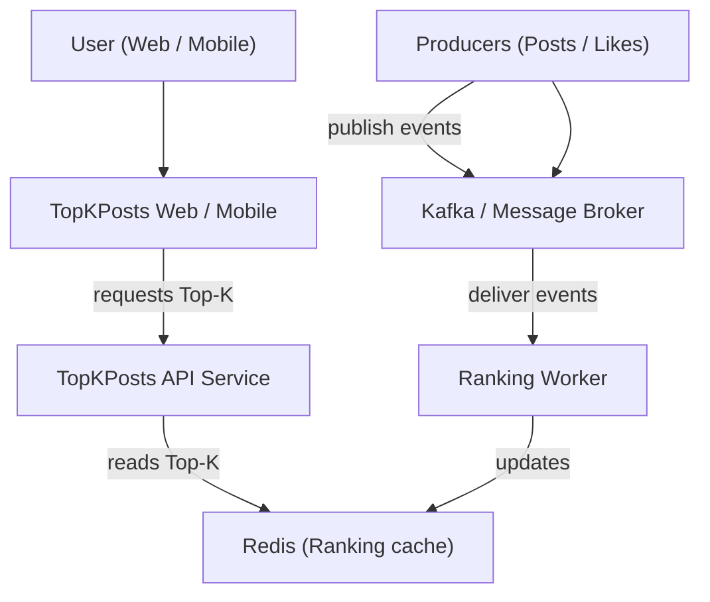
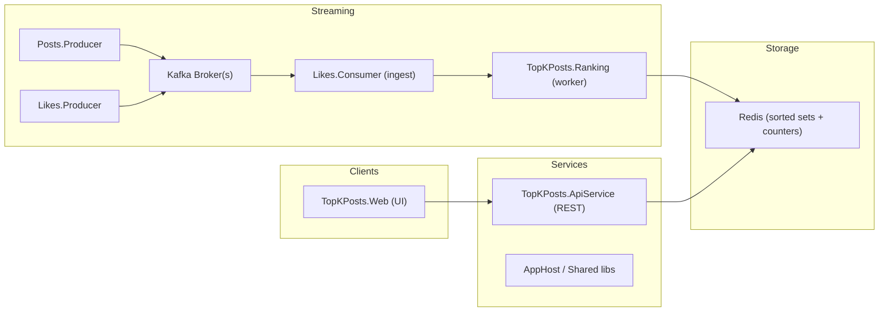

# TopKPosts — Real-time Top-K Posts

This repository uses .Net Aspire to build distributed system **Top K Posts** service, designed and evolved using a **sliced, incremental architecture** approach. The goal is to show how to start with the simplest thing that works, then gradually introduce more components only when needed.

---

# Demo


---

## 🚀 How to Run the Project

This project requires the latest tooling to support modern .NET and containerized development.

### 📦 Prerequisites

Make sure you have the following installed:

- **.NET 10 SDK** (required to build and run the services)
- **Docker** (required for running infrastructure components such as Redis, Postgres, and message brokers)
- **IDE / Editors**  
  - **Visual Studio** (latest version with .NET 10 support), or  
  - **Visual Studio Code** with the C# Dev Kit extension

You can verify your .NET installation with:

```bash
dotnet --version
```
---

## Slice 1 – Simple Polling Over a Single Database


The first slice is a straightforward setup:  
The client polls an application service for the top **N** posts, and the service reads directly from a relational database that stores posts and likes. Background workers update likes and posts in the same database.

### Pros
- Easiest to reason about and implement.  
- Minimal moving parts and operational overhead.

### Cons
- Read and write traffic compete on the same database.  
- Limited scalability when traffic or ranking complexity grows.

---

## Slice 2 – Adding Cache and Async Processing


The second slice introduces a **cache (Redis)** in front of the application service and background workers for posts and likes.  
The app still exposes a polling endpoint for top **N** posts, but now hot data is served from cache, while workers keep the cache in sync with the database.

### Pros
- Faster reads for top posts and reduced DB load.  
- Still relatively simple, while supporting higher traffic.

### Cons
- Still write traffic compete on the same database.

---

## Slice 3 – Event-Driven Ranking and Consumers


The third slice evolves into an event-driven architecture:  
Producers emit likes and posts events into a message broker; dedicated consumers and a ranking service process these events and update the cache.  
The application service continues to serve top **N** posts via polling, now backed by a ranking-aware cache.

### Pros
- Better scalability and decoupling between write path, ranking logic, and read path.  
- Easier to extend ranking algorithms and add new consumers without impacting the core API.

### Cons
- Higher complexity in deployment, operations, and failure handling.  
- Requires deeper observability and careful schema/version management for events.


This README explains the problem, the overall architecture and shows C4-style models (Context / Container / Component) to help developers and architects understand, extend and operate the system.

**Problem we solve**
- **Goal:** continuously maintain and serve the Top‑K posts by likes with low latency and horizontal scalability.
- **Constraints:** high write volume (likes and posts events), reads should be fast (API and UI), eventual consistency acceptable with bounded staleness, and the solution should be horizontally scalable.

Why streaming? Likes arrive as events. Recomputing Top‑K by scanning all posts on every update is expensive. Instead we maintain counters and a ranked structure (kept in Redis) and update it incrementally on each event.

High-level architectural summary
- Producers: components that emit domain events (post created, like added).
- Message broker: lightweight streaming backbone (Kafka in the code structure) used to reliably deliver events to consumers.
- Consumers / Workers: background processes that consume events, update counters and ranking state.
- Redis cache: stores counters and the sorted set for Top‑K for fast reads.
- API / Web: exposes Top‑K to clients and serves the UI.

Repository mapping
- `TopKPosts.Posts.Producer` — emits new post events
- `TopKPosts.Likes.Producer` — emits like events
- `TopKPosts.Posts.Consumer` — consumes post events (if any processing needed)
- `TopKPosts.Likes.Consumer` — consumes like events and forwards or transforms as needed
- `TopKPosts.Ranking` / `RankingWorker.cs` — the worker that computes/updates rankings
- `TopKPosts.Redis` — Redis cache wrapper and helpers (`RedisCacheService.cs`)
- `TopKPosts.ApiService` and `TopKPosts.Web` — API and UI layers for read access
- `TopKPosts.ServiceDefaults` / `TopKPosts.AppHost` — shared configuration and hosting helpers

Key data flows
- Topic `posts` — Post created/updated events (id, content, timestamp, ...)
- Topic `likes` — Like events (id, postId, timestamp)
- Ranking worker consumes `likes` and performs:
  - increment post like counter
  - update sorted set for ranking (Redis ZINCRBY / ZADD)

Serving Top‑K
- API reads the Top‑K from Redis sorted set (ZREVRANGE) which returns top items with O(log(N)+K) performance.

Scaling notes
- Producers are stateless — scale horizontally.
- Kafka scales by partitions — workers can form consumer groups for parallel processing.
- Redis: use a cluster for large datasets or shard Top‑K namespaces per tenant.

Security and reliability
- Use TLS and authentication for Kafka and Redis in production.
- Make sure consumers use idempotent updates (e.g., sequence numbers or deduplication) when events may be reprocessed.

C4 Models (text + renderable diagrams)

1) System Context (level 1)

This shows the TopKPosts system and its primary users / external systems.

Mermaid diagram (paste into a Mermaid renderer or use VS Code Mermaid preview):



2) Container Diagram (level 2)

Shows containers (run-time executables / services): API, Web, Producers, Consumers/Workers, Redis, Kafka.



Next steps and extensions
- Add monitoring around Kafka lag, Redis memory, and worker throughput.
